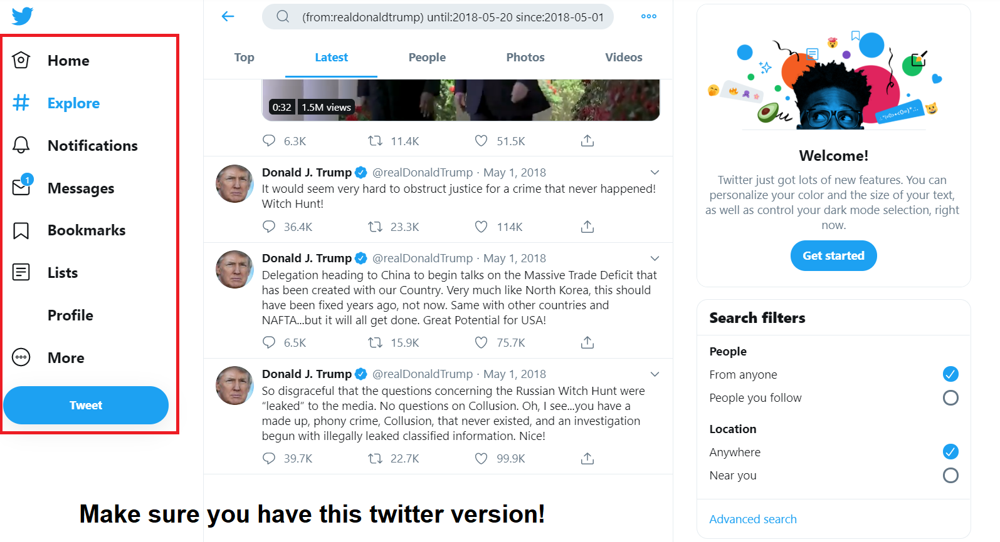

<!-- README.md is generated from README.Rmd. Please edit that file -->

```{r, include = FALSE}
knitr::opts_chunk$set(
  collapse = TRUE,
  comment = "#>",
  fig.path = "man/figures/README-",
  out.width = "100%"
)
```

# tweetsel

<!-- badges: start -->
<!-- badges: end -->

This package provides a way to get tweets of a user from a certain timerange using `Rselenium`.


Make sure that you are running a Twitter version that looks like this or else it won't work:


## Installation

The development version from [GitHub](https://github.com/) with:

``` r
# install.packages("devtools")
devtools::install_github("favstats/tweetsel")
```
## Example

Load in Package

```{r example}
library(tweetsel)

```


```{r, eval = F}
rD <- RSelenium::rsDriver(browser=c("chrome"), chromever="78.0.3904.105", port = port)

binman::list_versions("chromedriver")
```

Create a WebDriver with `RSelenium`

```{r, eval = F}
port <- sample(4000L:5000L, 1)
rD <- RSelenium::rsDriver(port = port)

driver <- rD$client
```

Get desired data in time range:

```{r, eval = F}

driver %>% 
  get_spec_timeline(screen_name = "realdonaldtrump", 
                  from = "2018-05-20",  #earliest date
                  until = "2018-05-01", #latest date
                  path = "data/tweets.csv") #specify how csv is named & saved

```

Output:

```{r}
read.csv("data/tweets.csv")
```

